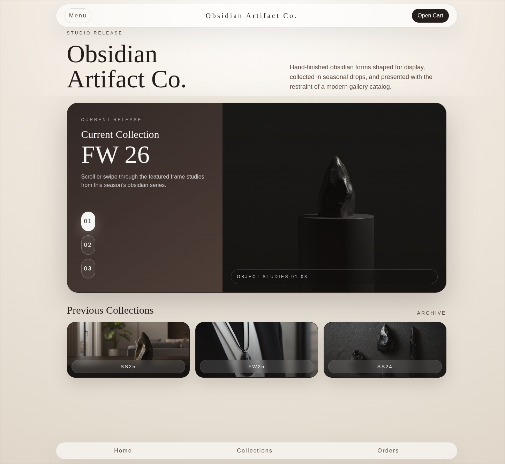

# BAIS Homepage Prototype



Frontend prototype for the BAIS home hero page, built in React, TypeScript, Tailwind CSS, and Vite. The current implementation focuses on a single polished landing experience with a semantic page shell, responsive layout behavior, and Playwright coverage for the key homepage interactions.

[Screen recording](./readme-assets/recording_20260302_12-40-28.mp4)

## Overview

- Implements the home "hero" page from the Figma target node documented in [features/FEATURE-home_page/FEATURE-SPEC.md](./features/FEATURE-home_page/FEATURE-SPEC.md).
- Uses semantic `header`, `main`, and `footer` landmarks with modular homepage components.
- Includes responsive behavior for mobile and desktop layouts plus baseline accessibility support.
- Validates the branch with ESLint and Playwright.

## Tech Stack

- React 19
- TypeScript
- Tailwind CSS 4
- Vite
- Playwright
- Nix dev shell for consistent local tooling

## Getting Started

### Prerequisites

- `nix`
- `pnpm`

If you want the repo-provided toolchain instead of relying on a host install:

```bash
nix develop
```

### Install Dependencies

```bash
pnpm install
```

### Run the App

```bash
pnpm dev
```

Open the local Vite URL shown in the terminal.

## Useful Scripts

```bash
pnpm dev
pnpm build
pnpm lint
pnpm test:e2e
pnpm check:pr
```

Nix-aware variants are also available for environments that need the extra browser library setup:

```bash
pnpm lint:nix
pnpm test:e2e:nix
pnpm check:pr:nix
```

## Project Structure

```text
src/
  app/                    App entry and router
  features/home/          Homepage components and data
  pages/home/             Page composition
e2e/                      Playwright end-to-end tests
features/                 Feature specs and Figma notes
readme-assets/            README screenshot and screen recording
```

## Current Feature Scope

The implemented homepage includes:

- A styled top navigation shell
- A hero section for "Obsidian Artifact Co."
- A current collection image selector with swipe/scroll support
- A previous collections archive row
- A styled footer navigation shell

The feature spec and checkpoint history live in [features/FEATURE-home_page/FEATURE-SPEC.md](./features/FEATURE-home_page/FEATURE-SPEC.md).

## Validation

Final branch verification was completed with:

```bash
pnpm check:pr:nix
```

That gate runs ESLint and the Playwright suite for both mobile and desktop homepage coverage.
